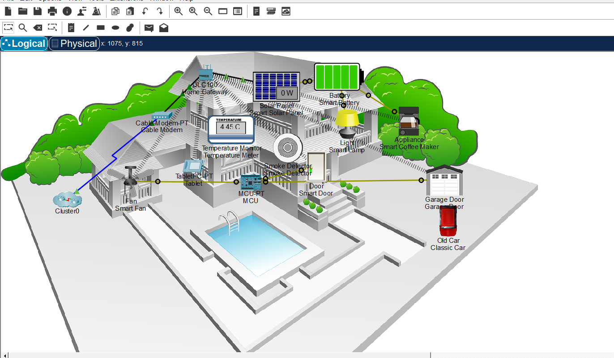

# LAB01 - Smart Home IoT Network

A Cisco Packet Tracer lab on a smart home IoT network, part of my preparation for the CCNA 200-301.

## Topology

## Devices
- Cable Modem and Home Gateway (DLC100) as the connection to the outside network
- MCU-PT and Tablet PC as controller and monitoring devices
- Smart devices: fan, lamp, door, garage door, smoke detector, temperature monitor, coffee maker, solar panel, and battery

## What I Did
[Write 2-3 sentences in your own words: did you build this topology yourself, or modify an existing Packet Tracer example? What did you set up or change?]

## What I Learned
[Write 2-3 sentences: for example, how IoT devices connect to the Home Gateway, or how the MCU works.]

## Files
- [LABS.01.pkt](LABS.01.pkt): Packet Tracer file
